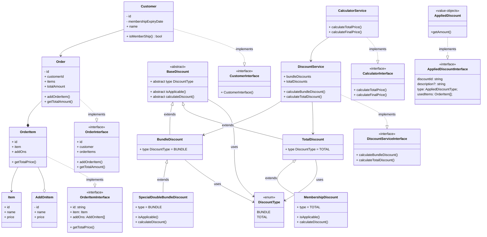

# Restaurant Service
### Class Diagram
Below is the class diagram for the `restaurant-service` project:

```mermaid
classDiagram
    OrderItem --> Item
    OrderItem --o AddOnItem
    Order --* OrderItem
    Customer --> Order

    BaseDiscount <|-- BundleDiscount:  extends
    BaseDiscount <|-- TotalDiscount :  extends
    BundleDiscount <|-- SpecialDoubleBundleDiscount:  extends
    TotalDiscount <|-- MembershipDiscount :  extends

    BaseDiscount --> DiscountType : uses
    BundleDiscount --> DiscountType : uses
    TotalDiscount --> DiscountType : uses
    DiscountService --> BundleDiscount
    DiscountService --> TotalDiscount

    CalculatorService --> DiscountService
    
    AppliedDiscount ..|> AppliedDiscountInterface : implements
    CalculatorService ..|> CalculatorInterface : implements
    Customer ..|> CustomerInterface: implements
    DiscountService ..|> DiscountServiceInterface : implements
    OrderItem ..|> OrderItemInterface : implements
    Order ..|> OrderInterface : implements
    
    
    class Customer {
        - id
        - membershipExpiryDate
        + name
        + isMemberShip() bool
    }

    class CalculatorService {
        + calculateTotalPrice()
        + calculateFinalPrice()
    }
    

    class Order{
        - id
        + customerId
        + items
        + totalAmount
        + addOrderItem()
        + getTotalAmount()
    }

    class AddOnItem {
        - id
        + name
        + price
    }

    class Item{
        + id
        + name
        + price
    }

    class OrderItem {
            + id
        + item
        + addOns
        + getTotalPrice()
    }

    class DiscountService {
        + bundleDiscounts
        + totalDiscounts
        
        + calculateBundleDiscount()
        + calculateTotalDiscount()
    }

    class DiscountType {
        <<enum>>
        BUNDLE
        TOTAL
    }

    class BaseDiscount {
        <<abstract>>
        + abstract type DiscountType
        + abstract isApplicable()
        + abstract calculateDiscount()
    }
        
    class BundleDiscount {
        + type DiscountType = BUNDLE
    }
    
    class SpecialDoubleBundleDiscount {
                + type = BUNDLE
                + isApplicable()
                + calculateDiscount()
    }
    
    class MembershipDiscount {
                + type = TOTAL
                + isApplicable()
                + calculateDiscount()
    }

    class TotalDiscount {
        + type DiscountType = TOTAL 
    }
    
    class AppliedDiscountInterface {
        <<interface>>
        discountId: string
        description?: string
        type: AppliedDiscountType;
        usedItems: OrderItem[];
    }
    
    class AppliedDiscount{
        <<value-objects>>
        +getAmount()
    }
    
    class CalculatorInterface {
    <<interface>>
    + calculateTotalPrice()
    + calculateFinalPrice()
    }
    
    class CustomerInterface {
    <<interface>>
    + CustomerInterface()
    }
    
    class DiscountServiceInterface {
        <<interface>>
        + calculateBundleDiscount()
        + calculateTotalDiscount()
    }

        class OrderItemInterface {
            <<interface>>
            + id: string
            + item: Item
            + addOns: AddOnItem[]
            + getTotalPrice()
        }
        
        class OrderInterface {
            <<interface>>
            + id
            + customer
            + orderItems
            + addOrderItem()
            + getTotalAmount()
        }
```